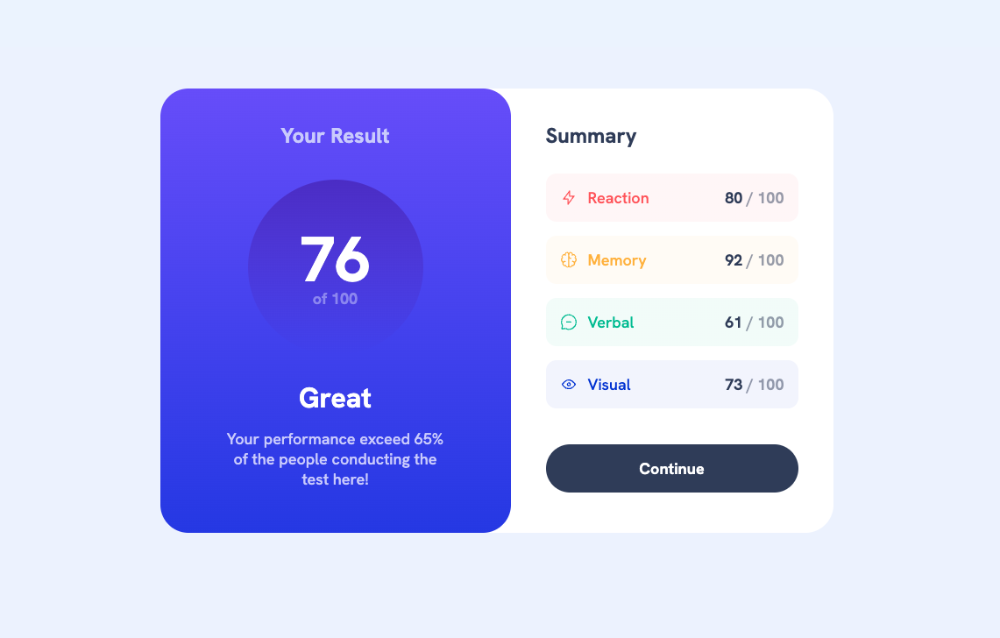

# Frontend Mentor - Results summary component solution

This is a solution to the [Results summary component challenge on Frontend Mentor](https://www.frontendmentor.io/challenges/results-summary-component-CE_K6s0maV). Frontend Mentor challenges help you improve your coding skills by building realistic projects. 

## Table of contents

- [Overview](#overview)
  - [The challenge](#the-challenge)
  - [Screenshot](#screenshot)
  - [Links](#links)
- [My process](#my-process)
  - [Built with](#built-with)
  - [What I learned](#what-i-learned)
  - [Continued development](#continued-development)
  - [Useful resources](#useful-resources)
- [Author](#author)


## Overview

### The challenge

Users should be able to:

- View the optimal layout for the interface depending on their device's screen size
- See hover and focus states for all interactive elements on the page

### Screenshot




### Links

- Solution URL: [Add solution URL here](https://your-solution-url.com)
- Live Site URL: [Add live site URL here](https://your-live-site-url.com)

## My process

### Built with

- Semantic HTML5 markup
- CSS custom properties
- Flexbox
- Desktop-first workflow
- [React](https://reactjs.org/) - JS library
- [Vite.js](https://vitejs.dev/) - React Framework


### What I learned

This time I learned how to fetch data from a JSON file located on another file in the project. I also learned more about useState and useEffect on this project. Mapping trough the data was also fun!

```jsx
useEffect(() => {
    const fetchData = async () => {
      const response = await fetch("/public/data/data.json");
      const data = await response.json();
      setSkillCategories(data);
    };
    fetchData();
  }, []);
```

```jsx 
<div className="skills-container">
            {skillCategories.map((skill) => (
              <div className={`skill ${skill.skillClass}`} key={skill.category}>
                <div>
                  
                  <p className="skill-name">{skill.category}</p>
                </div>
                <p>
                  <span className="score">{skill.score}</span> / 100
                </p>
              </div>
            ))}
          </div>
```


### Continued development

Next time I want to add the CSS extension language Sass. Because my current CSS code is a little bit messy (but commented). I hope i can bring a little bit more structure into it next time.


### Useful resources

- [mdn web docs](https://developer.mozilla.org/) Solid resource I use in almost every project. I looked up fetching data on this project.


## Author

- Website - [Dimitri Lavrentev](https://www.dlavrentev.com/)
- Frontend Mentor - [@yourusername](https://www.frontendmentor.io/profile/yourusername)
- Github - [@dlavrentev](https://github.com/dlavrentev)


